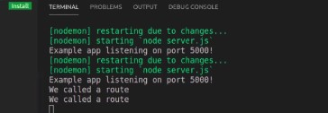

###### MIDDLEWARE

_sending requests with POSTMAN_

- Post method

https://expressjs.com/en/guide/writing-middleware.html - source!
[Express](https://expressjs.com/en/guide/writing-middleware.html)

- Login


  <br>
<br>
<br>
<br>

##### 1)\_\_ First steps | INSTALL DEPENDENCIES

```javascript
//install :
npm i express
npm i nodemon
/*


 Dont forget to add this "nodemon" otherwise when you will type nodemon server.js , it will
send an error and you will have to kill the server process if you already typed the npm start and start
all over again.

*/

```

<br>
<br>

##### 2)\_\_ snippets | basic template to start the app

```javascript
/*

the SNIPPET : e4-example-Hello
                                            Will give you all this:
*/

const express = require('express');
const app = express();

app.get('/', (req, res) => {
    res.send('Hello World!');
});

app.listen(port, () => {
    console.log('Example app listening on port port!');
});

//Run app, then load http://localhost:port in a browser to see the output.
------------


```

<br>
<br>
<br>

##### 3)\_\_ SETTING UP THE ROUTES (post)

```javascript
app.get("/", (req, res) => {
  res.json({
    message: "Hello World!",
  });
});

app.post("/", (req, res) => {
  res.json({
    message: "Hello World! POST",
  });
});
```

<br>


<br>
<br>

##### 3)\_\_ CHECK IF THEY ARE BEING CALLED CORRECTLY

<p>
  To see if they are being called correctly: go to the browser and refresh the localhost:5000 , also click in send in the RESTED "yu have to be in POST", by doing that you will have the result in the console in vs, like so:</p>

```javascript
app.get("/", (req, res) => {
  console.log("GET route / called");
  res.json({
    message: "Hello World!",
  });
});

app.post("/", (req, res) => {
  console.log("POST route / called");
  res.json({
    message: "Hello World! POST",
  });
});
//  ***** AFTER YOU FINISH, HIDE THE CONSOLE LOG *********
```

  <br>


<br>
<br>

##### 4)\_\_ USING next() TO EXECUTE SOMETHING IN ALL THE ROUTES

  <br>

```javascript
app.use("/");
```

<p>
Tipically when you define routes you start with this: use("/")
but in this new way you dont need it, you can start directly with
the ROUTE handlers (req, res) , like so:</p>

```javascript
app.use((req, res) => {
  console.log("CALLING A ROUTE");
});
```

<p>
But what is going to make the difference with
this new way is the use of: next() , next() is going to grab all 
the routes at the same time and therefore EXECUTE it in all of
them.   <br>  <br>
Test in the localhost then in the rested/POST 
</p>

```javascript
app.use((req, res, next) => {
  console.log("CALLING A ROUTE using next");
  next();
});
```

  <br>



<p>Here you can see the message twice, and thats is because its grabing the GET and the POST at the same time<p>
<br>
<br>

## MIDDLEWARE | what is it?

<p>
The Middleware will INTERCEPT and check
  if the data send is 
 correct, and only if it s correct it will FORWARD
 the user to the ROUTE, example:
 LOGIN for example , if the user dont give a correct
 answer, the middleware is not going to direct the user
 to the route of the welcome user blah(your fb perso profile )
</p>
