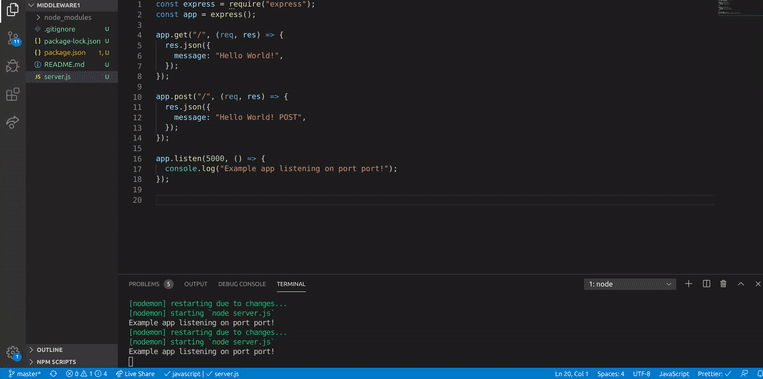

### MIDDLEWARE | Error HANDLING

<p>
Error Handling refers to how Express catches and processes errors that occur both synchronously and asynchronously. Express comes with a default error handler so you don’t need to write your own to get started. check more in the link below: </p>

[Interesting examples](https://expressjs.com/en/guide/error-handling.html)

##### Lesson of the day | common errors

<p>
START BY hiding the following: next(); to provoke an error </p>

```javascript
//MIDDLEWARE *******************
app.use((req, res, next) => {
  console.log(`We called a route ${req.url}`);
  next();
});
```

##### BY HIDING the next() you are going to cause a hanging or waiting situation

<p>When  the front end sends a request the backend is making it wait, and that
is because theres no NEXT to go to. That is the deal with MIDDLEWARE, you
always have to make sure  you have a way to progress to the next ROUTE, as the middleware is the interceptor and therefore the one
that will check if the user is allowed to pass or not and if there s not intermediary well there s no way to
make the connection. </p>

<br>


<br>
<br>

###### CALLING MULTIPLE MIDDLEWARES

<p>Check the results in the same way.
  Go to the browser and refresh the localhost:5000/get , this time dont go to post as in this example its only for the GET, unless you want to create an other MIDDLEWARE for POST</p>
<br>

```javascript
/* original, before the generic and specific

app.use((req, res, next) => {
  console.log(`We called a route ${req.url}`);
  // next();
});


*/

//MIDDLEWARE ******* GENERIC
app.use((req, res, next) => {
  console.log(`We called a route ${req.url}`);
  next();
});
//
// BOTH ARE GOING TO BE called
//
//MIDDLEWARE ******* ROUTE  SPECIFIC
app.use("/get", (req, res, next) => {
  console.log(`SPECIFIC ROUTE EXAMPLE, get`);
  next();
});
```

<hr>
<br>
<br>

_sending requests with POSTMAN_

- Post method

https://expressjs.com/en/guide/writing-middleware.html - source!
[Express](https://expressjs.com/en/guide/writing-middleware.html)

- Login


  <br>
<br>
<br>
<br>

##### 1)\_\_ First steps | INSTALL DEPENDENCIES

```javascript
//install :
npm i express
npm i nodemon
/*


 Dont forget to add this "nodemon" otherwise when you will type nodemon server.js , it will
send an error and you will have to kill the server process if you already typed the npm start and start
all over again.

*/

```

<br>
<br>

##### 2)\_\_ snippets | basic template to start the app

```javascript
/*

the SNIPPET : e4-example-Hello
                                            Will give you all this:
*/

const express = require('express');
const app = express();

app.get('/', (req, res) => {
    res.send('Hello World!');
});

app.listen(port, () => {
    console.log('Example app listening on port port!');
});

//Run app, then load http://localhost:port in a browser to see the output.
------------


```

<br>
<br>
<br>

##### 3)\_\_ SETTING UP THE ROUTES (post)

```javascript
app.get("/", (req, res) => {
  res.json({
    message: "Hello World!",
  });
});

app.post("/", (req, res) => {
  res.json({
    message: "Hello World! POST",
  });
});
```

<br>



<br>
<br>

##### 3)\_\_ CHECK IF THEY ARE BEING CALLED CORRECTLY

<p>
  To see if they are being called correctly: go to the browser and refresh the localhost:5000 , also click in send in the RESTED "yu have to be in POST", by doing that you will have the result in the console in vs, like so:</p>

```javascript
app.get("/", (req, res) => {
  console.log("GET route / called");
  res.json({
    message: "Hello World!",
  });
});

app.post("/", (req, res) => {
  console.log("POST route / called");
  res.json({
    message: "Hello World! POST",
  });
});
//  ***** AFTER YOU FINISH, HIDE THE CONSOLE LOG *********
```

  <br>


<br>
<br>

##### 4)\_\_ USING next() TO EXECUTE SOMETHING IN ALL THE ROUTES

  <br>

```javascript
app.use("/");
```

<p>
Tipically when you define routes you start with this: use("/")
but in this new way you dont need it, you can start directly with
the ROUTE handlers (req, res) , like so:</p>

```javascript
app.use((req, res) => {
  console.log("CALLING A ROUTE");
});
```

<p>
But what is going to make the difference with
this new way is the use of: next() , next() is going to grab all 
the routes at the same time and therefore EXECUTE it in all of
them.   <br>  <br>
Test in the localhost then in the rested/POST 
</p>

```javascript
app.use((req, res, next) => {
  console.log("CALLING A ROUTE using next");
  next();
});
```

  <br>


<p>Here you can see the message twice, and thats is because its grabing the GET and the POST at the same time<p>
<br>
<br>

## MIDDLEWARE | what is it?

<p>
The Middleware will INTERCEPT and check
  if the data send is 
 correct, and only if it s correct it will FORWARD
 the user to the ROUTE, example:
 LOGIN for example , if the user dont give a correct
 answer, the middleware is not going to direct the user
 to the route of the welcome user blah(your fb perso profile )
</p>

##### 5)\_\_ Check what Route is being called

<p>
Since the MIDDLEWARE sends a general message when grabbing all the ROUTES,
there s a way to identify which route 
is being called.

<br>
<br>
Start by adding the respective path method
to each of the routes you have like so:
</p>

```javascript
app.get("/get", (req, res) => {
// GET

app.post("/post", (req, res) => {
// POST
```

###### IT SHOULD LOOK LIKE THIS:

```javascript
app.get("/get", (req, res) => {
  res.json({
    message: "Hello World! Get",
  });
});

app.post("/post", (req, res) => {
  res.json({
    message: "Hello World! POST",
  });
});
```

###### NOW add the following

```javascript
console.log(`We called a route ${req.url}`);

/*

-- you have to add this: ${req.url}  

-- then
  check the localhost:5000/get (just refresh the browser ) and the "rested" on "POST" http://localhost:5000/post  (click on send)
  the result will be:
                                We called a route /post
                                We called a route /get

                                WITHOUT THIS   ${req.url}
                                you will not be able to have that result.
  */
```

###### IT SHOULD LOOK LIKE THIS:

```javascript
app.use((req, res, next) => {
  console.log(`We called a route ${req.url}`);

  next();
});
```

<br>
<br>


<br>
<br>
