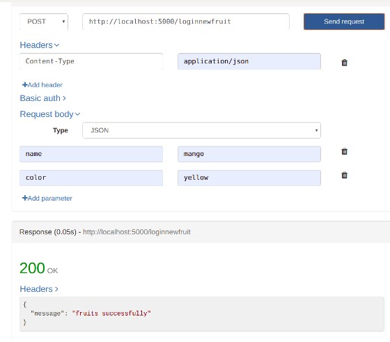
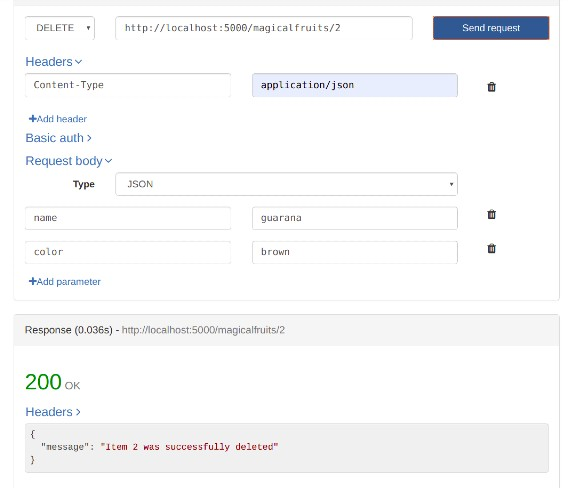

#### RECAP of the requests (POST GET ...) from 1 and 2 lessons

<br>

##### start by requiring the libraries and setting up the PORT

```javascript
const express = require("express");
const app = express();
//
let PORT = 5000;
app.listen(PORT, () => {
  console.log(`Example app listening on port ${PORT}!`);
});
});
```

<br>
<br>
<br>

### then set up the array with the items

```javascript
let magicalfruits = [
  {
    id: "0",
    color: "yellow",
    name: "mango",
    benefit:
      "mango flesh contains prebiotic dietary fibre, which helps feed good bacteria in the gut. Mangoes are rich in beta-carotene that helps in the production of Vitamin A. The powerful antioxidant helps improve vision, boosts overall eye health and even prevents age-related macular degeneration or loss of vision.",
  },
  {
    id: "1",
    color: "green",
    name: "plantain",
    benefit:
      "Cooked plantains are nutritionally very similar to a potato, calorie-wise, but contain more of certain vitamins and minerals. They're a rich source of fiber, vitamins A, C, and B-6, and the minerals magnesium and potassium. ",
  },
  {
    id: "2",
    color: "orange",
    name: "maracuja",
    benefit:
      "Passion fruit has a low glycemic index (GI) and high fibre content (10.4%). This makes it a great fruit to maintain insulin levels for diabetics. -Fruits like passion fruit are high in fibre like pectin that can make you feel full without increasing the calorie intake",
  },
];
```

<br>
<br>
<br>
<br>

##### DONT FORGET TO ADD THIS:

```javascript
// linked to the 500 error
app.use(express.json());
// HIDE THIS WHEN YOU WILL START WITH THE POST STUFFand then uncover it again when you will send the request
// i am still figuring it out when uncover and when not to uncover this

//
```

<br>
<br>

##### The WELCOME page

```javascript
app.get("/", (req, res) => {
  res.send("<h1>Assignement fruits</h1>");
});
```

<br>

##### THE ROUTE with the items array

<br>

```javascript
app.get("/magicalfruits", (req, res) => {
  res.json(magicalfruits);
});

/*

// check what you have in your list, also the new inserted fruits through /signupnewfruit  :

// http://localhost:5000/magicalfruits

*/
```

<br>

##### THE ROUTE with the items array ID

```javascript
app.get("/magicalfruits/:id", (req, res) => {
  const { id } = req.params;
  let fruit = magicalfruits.find((fruit) => fruit.id == id);

  res.json(fruit);
});
```

<br>

<br>

##### Sign up | POST

<br>


```javascript
// expect to get fields: email, password
app.post("/signupnewfruit", (req, res) => {
  let newFruit = req.body;
  // with the following : Date.now
  newFruit.id = Date.now().toString();

  //   with "push" you add an item
  magicalfruits.push(newFruit);
  res.json(newFruit);
});
```

<br>
<br>
<br>
<br>

##### Log in | POST

<br>



```javascript
// expect to get fields: email, password
app.post("/loginnewfruit", (req, res) => {
  //   if the user dont provide a name fruit and a color , send message : provide fruit and color
  if (!req.body.name && !req.body.color) {
    return res.json({ message: "provide name and color" });
  }

  let fruitFound = magicalfruits.find(
    (fruit) => fruit.name == req.body.name && fruit.color == req.body.color
  );

  if (!fruitFound) {
    res.json({ message: "fruits  succesfull" });
  } else {
    res.json({ message: "fruits unsuccessful" });
  }
});
```

<br>
<br>
<br>
<br>

##### Replace or modify items | PATCH


<br>

```javascript
app.patch("/magicalfruits/:id", (req, res) => {
  let { id } = req.params; //with params i reach a specific ID
  // Updating an object inside an Array
  let fruitFound = magicalfruits.find((fruit) => fruit.id == id);
  //   find, to find the record of the item in the array

  if (fruitFound) {
    //   IF the user is found you want to UPDATE IT
    //   object.assign , Its primary use case is to create a shallow copy of an object. https://flaviocopes.com/javascript-object-assign/
    Object.assign(fruitFound, { ...req.body });
    res.send(fruitFound);
  } else {
    res.json({
      message: "provide the required info!!!",
    });
  }
});
```

<br>

<br>

<br>

##### Delete items | DELETE

<br>



```javascript
app.delete("/magicalfruits/:id", (req, res) => {
  let { id } = req.params;
  magicalfruits = magicalfruits.filter(
    (magicalfruits) => id != magicalfruits.id
  );
  res.json({ message: `Item ${id} was successfully deleted` });
});
```

<br>
<br>
<br>
<br>
